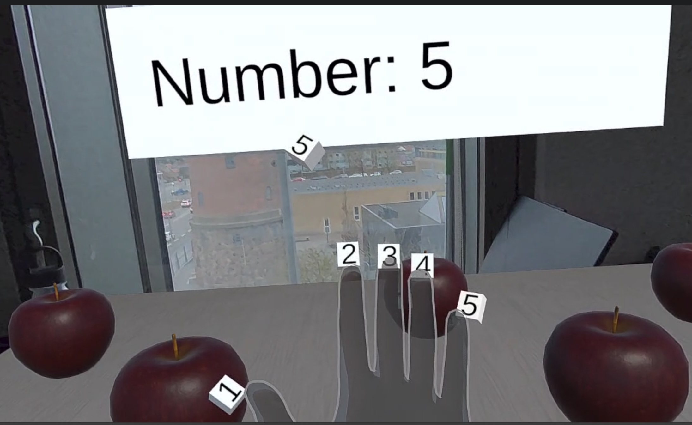
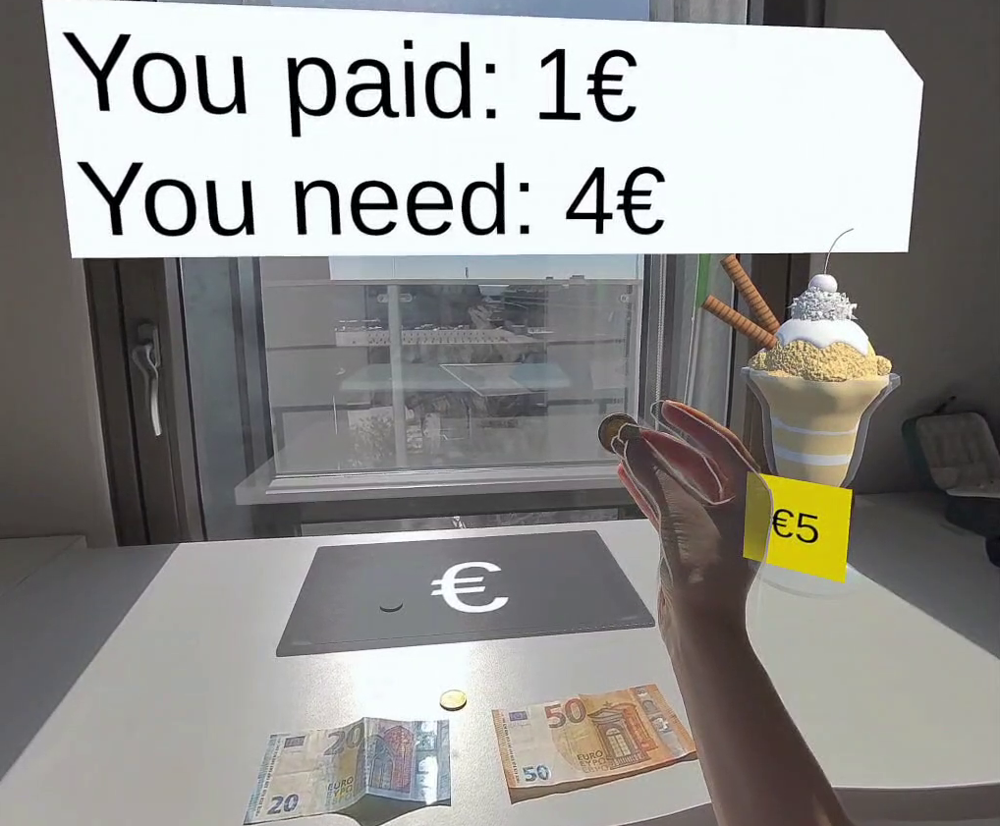
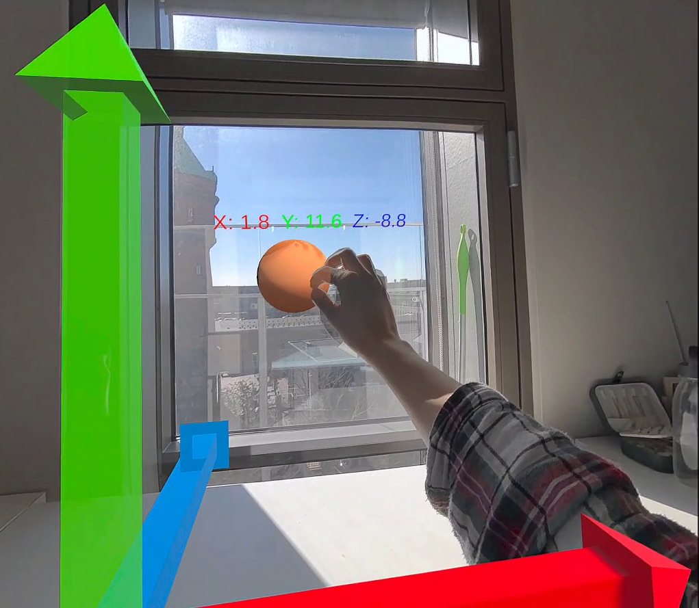

# SpaceFingerCoins-AR

> Three Mixed Reality prototypes supporting mathematical training for children (grades 1–9) with dyscalculia, built in Unity for Meta Quest 3.

Published at **IDC '25** — Interaction Design and Children, June 23–26, 2025, Reykjavik, Iceland.  
DOI: [10.1145/3713043.3731515](https://doi.org/10.1145/3713043.3731515)

---
| Finger Counting | Money Handling | Spatial Reasoning |
|:---:|:---:|:---:|
|  |  |  |
---

## Overview

This project explores how Augmented Reality (spatial computing) can enhance support strategies for children with dyscalculia by embedding them in dynamic, interactive physical environments. The prototypes augment traditional paper-based exercises with real-time visual feedback and embodied interaction, running on a Meta Quest 3 HMD via Scene Understanding (room-aware anchoring to real furniture).

The work is an early-stage technical exploration intended to inform future empirical studies under a Design-Based Research methodology.

---

## Scenes & Prototypes

### 🖐️ Finger Counting (`CountingFingers`, `AppleFingers`)

**Script:** `Assets/Scripts/Managers/FingersManager.cs`

Each finger is tagged with a number (1–10, split across left and right hand). When the user grabs a number off their finger and drops it on the virtual table, the corresponding quantity of apples spawns on the table surface. The canvas updates live with the current count.

- Hand pose detection via Oculus Interaction SDK (`HandPoses/` assets)
- Apple prefabs instantiated at fixed spatial offsets on the table
- `TableCollisionHandler.cs` manages drop detection
- `TilesManager.cs` / `NumberTile.cs` handle the draggable number tiles

---

### 💶 Money Handling (`Money`)

**Script:** `Assets/Scripts/Money/TrayCollision.cs`

Simulates buying an item (cost: $5). Physical currency objects (coins/notes in Euro and Dollar denominations, `.fbx` models with PBR textures) are moved into a tray. The system detects collisions with the tray and updates a UI showing amount paid and remaining balance.

- Currency models: `Assets/Resources/Money/Cash/` (€ and $ denominations)
- Ice cream target object: `Assets/Resources/Money/Ice cream/`
- Tray: `Assets/Resources/Money/Tray/tray.fbx`
- Cooldown-based collision handling to avoid double-counting

---

### 📐 Spatial Reasoning (`Cartesian`)

**Script:** `Assets/Scripts/Cartesian/PointController.cs`

A 3D Cartesian coordinate system anchored to the real room. A grabbable sphere displays its live coordinates (x, y, z) in colour-coded text (red/green/blue matching the axes), updating every physics frame via `FixedUpdate`.

- Axis model: `Assets/Resources/Cartesian/axis.fbx`
- Coordinate font: `Assets/Resources/Cartesian/FontCoordinates.asset`
- Coordinates scaled ×10 and snapped to zero below a 0.01 threshold for readability

---

## Architecture

```
Assets/
├── Scenes/
│   ├── SampleScene.unity        # Main menu / scene selector
│   ├── CountingFingers.unity    # Finger counting (number tiles)
│   ├── AppleFingers.unity       # Finger counting (apple quantity)
│   ├── Money.unity              # Money handling
│   └── Cartesian.unity          # Spatial reasoning
│
├── Scripts/
│   ├── Managers/
│   │   ├── FingersManager.cs    # Finger number show/hide, apple spawning
│   │   ├── Calculus.cs          # Basic arithmetic operations (UI)
│   │   ├── TableCollisionHandler.cs
│   │   └── TilesManager.cs
│   ├── Tiles/
│   │   ├── NumberTile.cs        # Draggable number tile behaviour
│   │   └── TileCollisions.cs
│   ├── Money/
│   │   └── TrayCollision.cs     # Coin/note drop detection & balance tracking
│   ├── Cartesian/
│   │   └── PointController.cs   # Live XYZ coordinate display
│   ├── SceneUnderstanding/
│   │   ├── FurnitureSpawner.cs  # OVR scene anchor → virtual furniture
│   │   ├── SimpleResizable.cs
│   │   ├── SimpleResizer.cs
│   │   ├── Spawnable.cs
│   │   └── OVRSceneMangerAddons.cs
│   ├── UI/
│   │   ├── SceneLoader.cs
│   │   ├── ButtonVR.cs
│   │   └── DebugTextManager.cs
│   └── Misc/
│       ├── TableAdjuster.cs
│       └── Development.cs
│
├── Resources/
│   ├── Apple/                   # Low-poly apple model + PBR textures
│   ├── Cartesian/               # Axis model + coordinate font
│   ├── HandPoses/               # OVR hand pose assets (pinch, open, scissors…)
│   ├── Money/Cash/              # € and $ banknote models + PBR textures
│   ├── Money/Ice cream/         # Target purchase model
│   ├── SimpleHands/             # Stylised hand prefabs (black/white)
│   ├── Models/                  # Furniture samples (FBX)
│   └── Icons/                   # Scene selector icons
│
└── Prefabs/
    ├── MRDesk/                  # Mixed Reality desk with shadow shader
    ├── Poses.prefab             # Hand pose collection
    ├── NumberTwo.prefab         # Example number tile
    └── ...
```

---

## Requirements

| | |
|---|---|
| **Unity** | 2022.3.20f1 (LTS) |
| **Target device** | Meta Quest 3 |
| **Meta XR SDK** | `com.meta.xr.sdk.all` 63.0.0 |
| **XR Plugin** | `com.unity.xr.oculus` 4.2.0 |
| **TextMeshPro** | 3.0.8 |
| **Build target** | Android (Meta Quest) |

---

## Getting Started

1. Clone or download the repository.
2. Open the project in **Unity 2022.3.20f1**.
3. In **Edit → Project Settings → XR Plug-in Management**, ensure the **Oculus** loader is enabled for Android.
4. Connect your Meta Quest 3 in developer mode.
5. Open `Assets/Scenes/SampleScene.unity` and build to device (**File → Build Settings → Build and Run**).

> **Scene Understanding:** The prototypes use OVR Scene Understanding to anchor content to real furniture. Before running, complete the room setup in the Meta Quest OS (scan your room). The `FurnitureSpawner` component will automatically place virtual overlays on detected surfaces (tables, floor, ceiling).

---

## Key Dependencies (Packages/manifest.json)

- `com.meta.xr.sdk.all` 63.0.0 — Oculus Interaction, Hand Tracking, Scene Understanding
- `com.unity.xr.oculus` 4.2.0 — XR provider
- `com.unity.xr.core-utils` 2.5.2
- `com.unity.textmeshpro` 3.0.8

---

## Authors

| Name | Affiliation | Contact |
|---|---|---|
| **Vittoria Frau** | Digital Design and Information Studies, Aarhus University | vittoria.frau@cc.au.dk |
| **Germán Leiva** | Digital Design and Information Studies, Aarhus University | leiva@cavi.au.dk |
| **Eva Eriksson** | Aarhus University | evae@cc.au.dk |

---

## Citation

```bibtex
@inproceedings{frau2025dyscalculia,
  author    = {Frau, Vittoria and Leiva, Germ\'{a}n and Eriksson, Eva},
  title     = {Supporting Mathematical Training for Children with Dyscalculia through Augmented Reality},
  booktitle = {Interaction Design and Children (IDC '25)},
  year      = {2025},
  location  = {Reykjavik, Iceland},
  publisher = {ACM},
  doi       = {10.1145/3713043.3731515}
}
```

---
